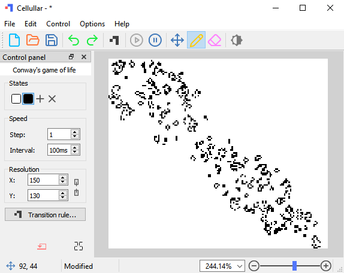

## What is *Cellullar*?

**`Cellullar`** is a *multistate* and *programable* cellular automaton engine usefull for dynamic simulations.

## Main interface

## How to interact with the automaton

- To evolve the automaton click on _resume_ button.

- To edit states go to `states` in the control panel.

- To edit the speed goto `speed` in the control panel.

- The `size` field is the  size of the automaton.

- The LCD number at the bottom right is the current generation.

## How to edit the transition rule

You can open the _transition rule_ editor by clicking on the `Transition rule..` button.

- The used language is `javascript`.

- The script must return a `function` with 9 arguments.

- The distribution of arguments in the neighborhood is:
  
  | **`arg5`** | **`arg4`** | **`arg3`** |
  | ---------- | ---------- | ---------- |
  | **`arg6`** | **`arg1`** | **`arg2`** |
  | **`arg7`** | **`arg8`** | **`arg9`** |
  
  Where **`arg1`** represents the current cell and the rest are its neighboring cells.

- Using other identifiers are posible, for example: `o`, `a`, `b`, `c`, `d`, `e`, `f`, `g`, `h`.
